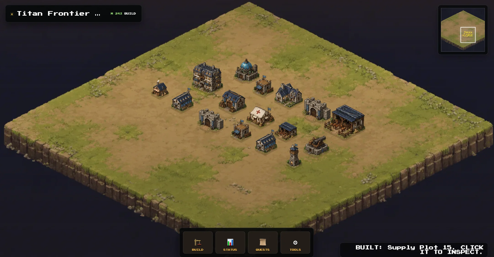
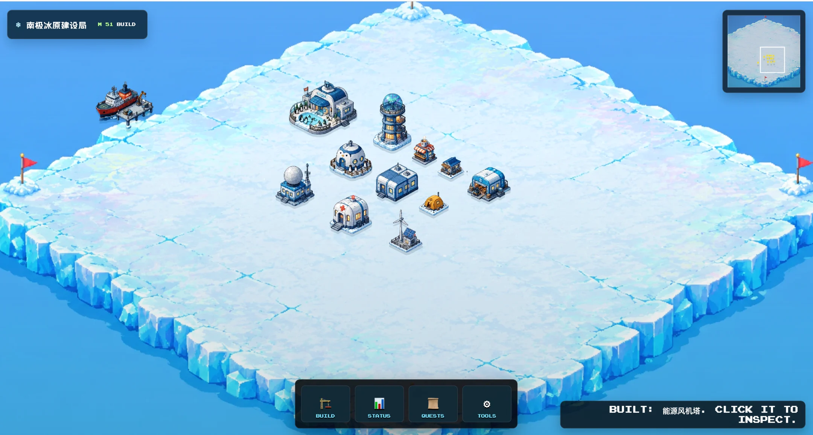
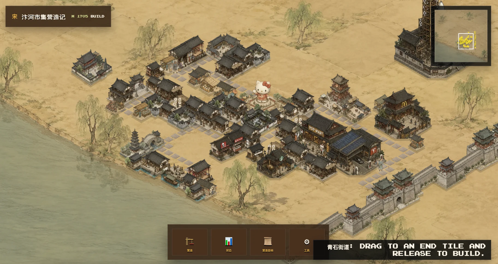
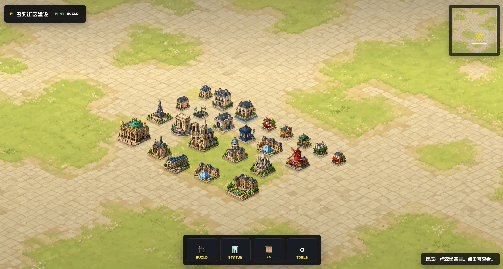

# City Builder Engine

A manifest-driven asset pipeline for reskinning static HTML/CSS/JS city-builder and management games. Generate themed sprite sheets with AI image providers, remove backgrounds, crop them into final assets, and drop them into your existing game runtime—without rewriting gameplay code.

**Core philosophy: Reuse first. Reskin second. Rebuild never.**

---

## What it does

1. **Generate** a white-background asset sheet (e.g. 4×4 grid of buildings) via OpenAI Images API or any external CLI tool.
2. **Remove backgrounds** with a no-crop cutout so grid geometry stays stable.
3. **Crop** each slot into individual sprites by fixed row/column coordinates.
4. **Flatten or preserve alpha** depending on your runtime contract.
5. **Replace** the original game assets in-place and verify with visual QA.

---

## Showcase

| Titan Frontier | Antarctic Ice Base |
|:---:|:---:|
|  |  |

| Paris Landmarks | Song Dynasty Market |
|:---:|:---:|
|  |  |

All themes above were generated with the same engine pipeline: **AI sheet generation → background removal → deterministic crop → drop into the same static HTML/CSS/JS runtime.**

---

## Quick start

### 1. Install

```bash
git clone https://github.com/Yvelinmoon/city-builder-engine.git
cd city-builder-engine
pip install -r requirements.txt
```

If you plan to use background removal, also install:

```bash
pip install rembg
```

### 2. Set your API key

```bash
export OPENAI_API_KEY="sk-..."
```

### 3. Write a manifest

Create `manifest.json`:

```json
{
  "theme": "cyberpunk-city",
  "camera_mode": "isometric",
  "provider": {
    "type": "openai",
    "api_key_env": "OPENAI_API_KEY",
    "model": "gpt-image-2",
    "cutout": {
      "type": "rembg"
    }
  },
  "sheets": [
    {
      "id": "buildings",
      "prompt": "cyberpunk isometric buildings, 4x4 white background sheet, 16 slots, consistent style, no text, no logo",
      "raw": "output/raw/buildings.png",
      "cutout": "output/cutout/buildings.png",
      "rows": 4,
      "cols": 4,
      "remove_background": true,
      "final_opaque": false,
      "slices": [
        {
          "id": "tower-a",
          "row": 0,
          "col": 0,
          "target": "game/assets/buildings/tower-a.png"
        }
      ]
    }
  ]
}
```

### 4. Run

```bash
python engine/sheet_engine.py \
  --manifest manifest.json \
  --workers 1
```

After running, check `game/assets/buildings/tower-a.png` for the final crop.

---

## Provider modes

The engine supports two generation drivers:

| Mode | Description | Use when |
|------|-------------|----------|
| `openai` | Built-in HTTP driver for OpenAI Images API (`gpt-image-2`, `dall-e-3`) | You have an OpenAI API key |
| `command` | Subprocess CLI fallback | You have another image generation CLI |

And three cutout strategies:

| Cutout | Description | Use when |
|--------|-------------|----------|
| `rembg` | Local `rembg` CLI, preserves canvas size | You installed `rembg` |
| `none` | Skip background removal | You only need opaque crops or handle transparency later |
| `command` | External CLI fallback | You have a custom cutout tool |

See [`docs/PROVIDER_SETUP.md`](docs/PROVIDER_SETUP.md) for full configuration details.

---

## File structure

```
city-builder-engine/
├── engine/
│   ├── sheet_engine.py          # Main pipeline engine
│   ├── manifest.schema.json     # JSON Schema for manifest validation
│   └── make_showcase.py         # Contact sheet generator for QA
├── templates/
│   └── tools/
│       └── sheet_pipeline_template.py   # Minimal adapter template
├── docs/
│   ├── STEPS.md                 # Full workflow checklist
│   ├── NOTES.md                 # Design cautions and lessons
│   └── PROVIDER_SETUP.md        # Provider configuration guide
├── prompts/
│   └── PROMPT_TEMPLATES.md      # Prompt patterns for sheets and backgrounds
├── references/
│   ├── standard-4x4-sheet-policy.md
│   ├── sheet-generation-and-cropping.md
│   └── kairo-placement-runtime-reference/   # Example static game runtime
└── requirements.txt
```

---

## Key concepts

- **Manifest** (`manifest.json`) — declares sheets, slices, provider config, and camera mode.
- **Sheet** — one generated image (e.g. 1024×1024) containing multiple assets in a grid.
- **Slice** — a single cell in the sheet, defined by `row` and `col`, mapped to a final `target` file.
- **Provider** — the image generation driver (`openai` or `command`).
- **Cutout** — background removal step that runs before cropping.

---

## Camera modes

- `isometric` — 3/4 top-down orthographic view, 2:1 diamond tile footprint (default)
- `rpg_topdown` — Classic 2D RPG map camera, square-grid footprint

Set in manifest: `"camera_mode": "isometric"`

---

## License

MIT
